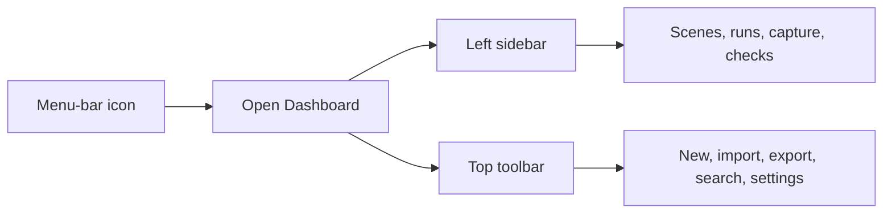

# Simple App Guide

This is the easiest way to learn Workspace Orchestrator without understanding every advanced option first.

## Three ideas to know

- A **scene** is a saved workspace, such as “Start Work” or “Open Project Alpha.”
- An **action** is one step inside a scene, such as opening an app, URL, folder, or terminal.
- A **run** is what happens when you start a scene. Workspace Orchestrator records each step and shows whether it succeeded.

For your first scene, you can ignore dependencies, retries, conditions, health checks, concurrency, and deactivation actions. Those controls are available when you need more automation later.

## The simplest first-use path

1. Click the Workspace Orchestrator icon in the macOS menu bar.
2. Choose **Open Dashboard**.
3. Select **Scene Library** in the left sidebar.
4. Choose **Install Demo** to add a safe example without running it.
5. Select **Edit** beside the demo and look through its actions.
6. Choose **Cancel** to leave the editor unchanged, then choose **Run** when you are ready.
7. Open **Current Run** to watch each action.
8. Open **Run History** afterward to review what happened.

Installing, importing, or capturing a scene never runs it automatically.

## How the app is organized

### 1. Menu-bar icon

Use the menu-bar popover for quick access without keeping the Dashboard open.

| Control | What it does |
| --- | --- |
| Primary button | Opens the Dashboard by default. You can change it in **Settings → General**. |
| Favorites and Recent | Runs a saved scene directly. |
| Cancel Current Run | Asks an active run to stop. |
| Stop Current Scene | Runs the scene's stop plan after the active run has finished. |
| Open Dashboard | Opens the main app window. |
| Open Command Palette | Opens keyboard-friendly search and scene launching. |
| Run History | Opens previous run records. |
| Permissions | Opens the permission center. |
| Begin Voice Command | Starts one explicit on-device voice session when enabled. |
| Double-Clap Detection | Turns the optional local clap listener on or off. |
| Settings | Opens all preferences and advanced controls. |

### 2. Main window sidebar

The left sidebar is the main way to move around the app.

| Sidebar destination | What it is for | Go here when… |
| --- | --- | --- |
| **Dashboard** | A summary of the current workspace, recent scenes, recent runs, warnings, and failures. | You want a quick status check. |
| **Scene Library** | The list of saved scenes. Run, edit, install the demo, or delete a scene here. | You want to create, change, or start a workspace. |
| **Current Run** | Live action-by-action progress for the scene that is running now. | You want to see what the app is doing or cancel it. |
| **Run History** | Searchable local records of previous runs. | You want to inspect, retry, create a scene copy, export, or troubleshoot an earlier run. |
| **Capture Workspace** | Builds a draft scene from selected running apps, reviewed windows, and URLs you enter. | Your workspace is already open and you want to save it. |
| **Integrations** | Shows which supported local tools the app can actually find. | An editor, terminal, Docker, or other tool action is unavailable. |
| **Permissions** | Shows Accessibility, Microphone, Speech Recognition, and Notification access. | Window capture, clap, voice, or notifications are not working. |
| **Diagnostics** | Shows app version, storage, architecture, permissions, and a bounded support summary. | You are troubleshooting or preparing a support report. |

Favorite scenes also appear under the sidebar destinations. Clicking a favorite there runs it directly.

### 3. Top toolbar

The toolbar stays available while you move through the main window.

| Button | What it does |
| --- | --- |
| **New Scene** | Opens a blank Scene Builder. |
| **Import** | Opens a scene archive or JSON file for review. Imports remain untrusted until reviewed. |
| **Export All** | Saves all scenes to a portable archive without Keychain secret values or approval grants. |
| **Command Palette** | Searches scenes and common commands. The default shortcut is `⌥⌘Space`. |
| **Settings** | Opens the separate Settings window. |

## Scene Library and Scene Builder

Use **Scene Library** for the scenes you already have. Use **New Scene** in the toolbar to build one.

In Scene Builder:

1. Give the scene a clear name.
2. Under **Start Workspace**, choose **Add Action**.
3. Pick an action type and fill in its visible fields.
4. Add more actions if needed.
5. Choose **Save**. If something is invalid, the editor explains what must be fixed.

The available action types are:

| Action | Simple meaning |
| --- | --- |
| Open Application | Opens a macOS app. |
| Browser Workspace | Opens one or more reviewed web URLs. |
| Open File or Folder | Opens or reveals a local path. |
| One-Shot Process | Runs one executable with a structured argument list, then waits for it to finish. |
| Managed Process | Starts a longer-running local process that Workspace Orchestrator can track and stop. |
| Wait | Pauses the scene for a specified time. |
| Editor Workspace | Opens a project in a supported code editor. |
| Terminal Workspace | Opens a terminal workspace, with optional tmux support. |
| Docker Compose | Starts reviewed Docker Compose services. |
| macOS Shortcut | Runs a named shortcut. |
| Window Layout | Restores reviewed window positions created through **Capture Workspace**. |

Under **Stop Workspace**, you can optionally add the actions that should run when you choose **Stop Current Scene**.

Advanced controls such as failure policy, retries, dependencies, conditions, health checks, and concurrency are explained in the [Scene Builder guide](SCENE_BUILDER.md). You do not need them for a basic scene.

## Running and stopping a scene

You can start a scene from its **Run** button in Scene Library, a recent scene on Dashboard, a favorite/recent menu-bar item, or the Command Palette.

After starting:

- Go to **Current Run** for live progress.
- Choose **Cancel Run** only if you want to interrupt work that is still executing.
- After the run finishes, choose **Stop Current Scene** from the menu bar when you want its stop plan to run.
- Go to **Run History** for the permanent local record.

Common final states are:

| Status | Meaning |
| --- | --- |
| Ready | Required work and readiness checks succeeded. |
| Ready with warnings | The workspace is usable, but an optional step or check had a problem. |
| Failed | A required step failed. Open the run to see the exact action and reason. |
| Cancelled | You stopped the run before it completed. |
| Interrupted | The app or Mac stopped while a run was active. The app will not silently resume it. |

## Capture an existing workspace

Use this route when your apps are already arranged the way you want:

**Capture Workspace → name the scene → select apps → optionally enter URLs → Review Window Capture → Save Reviewed Scene**

Window details require Accessibility permission. Capture creates a draft for review; it does not inspect browser history, terminal history, clipboard data, environment variables, Docker projects, document contents, or secrets.

## Review or fix a previous run

Use this route:

**Run History → filter or search → select a run**

The detail window shows the stored scene snapshot, each action, attempts, timing, readiness checks, errors, and bounded output. From there you can:

- retry the full stored snapshot;
- retry failed actions and their dependents;
- open the snapshot as a new editable scene; or
- export a bounded, redacted diagnostic report.

Every retry shows a fresh preview first. Nothing is retried silently.

## Settings without the overload

Open Settings from the menu bar or the gear button in the toolbar. You only need **General** at first.

| Settings tab | What it controls |
| --- | --- |
| **General** | Startup behavior, notifications, update checks, default scene, and menu-bar contents. |
| **Appearance** | Theme, motion/effects, compact rows, and sounds. |
| **Activation** | Keyboard shortcut, double-clap calibration/test, voice commands, and spoken status. |
| **Execution** | Defaults for new scenes: concurrency, timeout, retry, failure, health-check, ownership, and approval behavior. Existing scenes are not changed. |
| **Privacy** | Run-history retention, bounded output, and non-revealing Keychain secret-reference management. |
| **Permissions** | Current optional permission state and links to macOS System Settings. |
| **Integrations** | The locally detected supported tools and their paths. |
| **Advanced** | Import/export, local-data locations, approvals, diagnostics, and carefully scoped reset tools. |
| **About** | Version, build, product scope, and project information. |

Microphone, Speech Recognition, notifications, and Accessibility are optional. Grant a permission only when you decide to use the related feature.

## If you feel lost

1. Click the menu-bar icon.
2. Choose **Open Dashboard**.
3. Select **Scene Library** to find your saved workspaces.
4. Select **Current Run** if something is currently happening.
5. Select **Run History** if something already happened.
6. Check **Integrations** and **Permissions** if an action cannot start.

The fastest keyboard route is `⌥⌘Space`, then type a scene name or choose **Open Dashboard**, **Open History**, or **Capture Workspace**.

For more detail, continue with the [Quick Start](QUICK_START.md), full [User Guide](USER_GUIDE.md), or [Troubleshooting](TROUBLESHOOTING.md).
