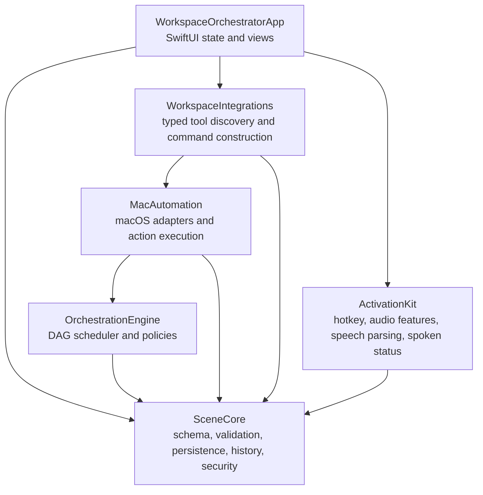

# Architecture

## Module boundaries

Workspace Orchestrator is a local native macOS application split into five Swift packages and one presentation target. Dependencies point inward toward `SceneCore`; platform side effects remain protocol-backed.

- `SceneCore` imports Foundation only. It owns stable Codable schemas, validation, V1-to-V2 migration, archives, run state/history, process approvals, and redaction.
- `OrchestrationEngine` is platform-neutral. It schedules a validated DAG deterministically with bounded parallelism, dependencies, conditions, retries, health checks, failure policies, cancellation, and deactivation.
- `MacAutomation` owns Foundation/AppKit/ApplicationServices/Network/Security/ServiceManagement/UserNotifications effects. Application, URL, file, process, health, Keychain, window, login, and notification effects sit behind mockable protocols.
- `WorkspaceIntegrations` discovers supported local tools and translates typed scene actions into executable-plus-argument requests. It never accepts a shell string.
- `ActivationKit` isolates Carbon hotkeys, AVFoundation audio features, Speech parsing, and synthesised status. Services are opt-in and local.
- `WorkspaceOrchestratorApp` owns `@MainActor` observable state, navigation, presentation, confirmation, and permission prompts. Views do not instantiate `Process` or call `NSWorkspace`.

## Data and execution flow

Scenes are decoded as untrusted input, migrated if they are V1, validated, and persisted atomically under Application Support. Corrupt data is preserved and the error is surfaced. Import first produces a review preview; imported scenes remain untrusted until explicitly saved.

Activation validates the scene again. Process-bearing actions pass an exact fingerprint approval gate. The orchestration engine schedules ready actions by stable scene order, capped by `maximumParallelism`. Each action records attempts, health checks, owned resources, timestamps, output according to retention policy, and a typed user-facing failure. Required dependency failure skips downstream work; optional/continue policies remain visible. Cancellation propagates to active tasks and managed resources owned by the run.

Live snapshots and completed run records are written separately from scene definitions. An interrupted snapshot is detected at launch and presented as recovery information; it is not silently resumed. Run retention is bounded by count and age, and writes are atomic.

## Security architecture

- Commands are an absolute executable plus `[String]` arguments and typed environment values.
- Restricted executables and shell wrappers are rejected in validation and execution.
- Exact process approvals bind executable, arguments, working directory, and environment references; one-time approvals are consumed.
- Secret environment values are Keychain references. Plain secret values are not serialized.
- HTTP checks use normal platform TLS validation. TCP and all polling checks have explicit timeouts and bounded intervals.
- Window control is isolated behind Accessibility permission and uses reviewed normalized placement data.
- Clap and speech services start only after explicit enablement and expose their active state.
- No telemetry, cloud API, account, remote control, arbitrary plug-in loading, or auto-update code is present in V1.

## Concurrency and recovery

Actors protect scene storage, history, process approvals, and managed-process state. The orchestration scheduler owns run-local task groups and emits immutable snapshots. Retry timing and jitter are injectable for deterministic tests. On relaunch, stale live state is marked interrupted and the user chooses a new activation or cleanup; the application never invents success.

## Test boundaries

SceneCore and OrchestrationEngine tests are platform-neutral. MacAutomation tests inject application, URL, file, health, and window adapters; automated tests never launch real apps or browsers. Harmless explicit process fixtures are permitted. Integration and activation parsing/audio-feature tests are deterministic. The Xcode application build validates the SwiftUI composition independently from package tests.

## Extension rules

New scene actions require a backward-conscious schema change, validation, typed execution protocol, tests, documentation, and import-review representation. New side effects belong in an adapter module. Third-party dependencies require an ADR covering security, license, pinning, maintenance, and reproducibility.
