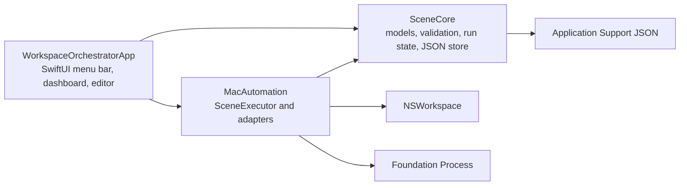

# Architecture

## Components and boundaries

`SceneCore` owns platform-independent data and rules. `MacAutomation` owns operating-system side effects and execution policy. `WorkspaceOrchestratorApp` owns presentation and coordinates dependencies. SceneCore imports Foundation only; it never imports SwiftUI or AppKit. UI views never launch applications, open URLs, or create processes.

## Main types

- `Scene`, `SceneAction`, and the three action payloads form schema version 1.
- `SceneValidator` returns path-specific issues and fails closed.
- `JSONSceneStore` is an actor implementing `SceneStoring` with atomic collection writes.
- `ActionExecutionRecord`, `ProcessExecutionResult`, and `SceneRunResult` preserve observable state.
- `ApplicationOpening`, `URLOpening`, and `ProcessRunning` are dependency-injection seams.
- `FoundationProcessRunner` directly executes an absolute path and captures both pipes.
- `SceneExecutor` validates, runs actions sequentially, stops after failure, and observes task cancellation.
- `AppModel` is `@MainActor` state that connects UI intents to the store and executor.

## Data flow

The editor modifies an in-memory `Scene`. Save validates it, asks `JSONSceneStore` to update the collection, and reloads sorted scenes. Run validates again, creates pending action records, and sends immutable result snapshots to `AppModel`. The dashboard renders those snapshots; adapters never know about SwiftUI.

## Scene execution lifecycle

1. Create an idle result with all actions pending.
2. Validate untrusted scene data; validation failure ends as failed before side effects.
3. Mark the scene running and each action running in configured order.
4. Call exactly one injected adapter and record timing or process output.
5. Mark success and continue, or preserve the error and leave later actions pending.
6. A cancelled task terminates the active process where applicable and finishes cancelled.
7. All-actions success finishes the scene succeeded.

The sequential loop is intentionally small enough to later host an execution strategy abstraction for dependencies, retries, or parallelism without changing action schemas prematurely.

## Persistence architecture

`JSONSceneStore` writes `scenes.json` under `~/Library/Application Support/WorkspaceOrchestrator`. It creates a missing directory, returns an empty collection when no file exists, validates every decoded scene, performs atomic writes, and surfaces decoding/filesystem errors. A failed load never triggers a write, so corrupt bytes remain available for recovery.

## Error handling and cancellation

Domain validation provides field paths and readable messages. Adapter errors use typed localized errors. Nonzero exits and timeouts become action failures, including captured output. App errors are presented rather than swallowed. Cancellation is Swift task cancellation propagated through the executor to the process runner; the process is terminated and recorded as cancelled.

## Testing strategy

SceneCore tests cover schema round trips, unknown actions, validation, CRUD, missing storage, and corruption. MacAutomation tests use real harmless executables for process semantics and actors as mocks for application/URL adapters. Executor tests verify order, stopping, error preservation, nonzero exit, and cancellation. Automated tests never launch an application or browser. CI repeats Swift builds/tests and the unsigned native Xcode build.
